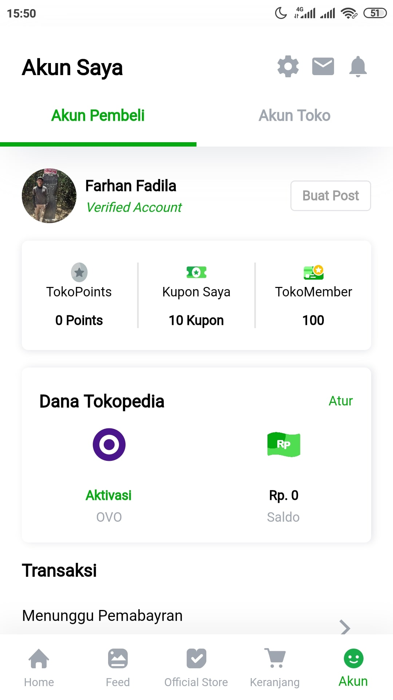

# Tokopedia Clone v.2020 Clone With Flutter
[![flutter][]][web flutter] [![badge paypal][]][paypal account] [![badge linktree][]][linktree account]  
> Tokopedia UI Clone With Flutter, is used flutter v.1
In the near future this project will not have any changes. But I plan to make a clone of the latest version Tokopedia.

 &nbsp;

---

### 🚧 Maintener 
[![account avatar][]][github account]  
**Farhan Fadila**  
📫 How to reach me: farhan.fadila1717@gmail.com

### ❤️ Suport Maintener
[![badge paypal][]][paypal account] [![badge linktree][]][linktree account]

[flutter]: https://img.shields.io/badge/Platform-Flutter-02569B?logo=flutter
[web flutter]: https://flutter.dev
[account avatar]: https://avatars.githubusercontent.com/u/43161050?s=80
[badge linktree]: https://img.shields.io/badge/Donate-farhanfadila-orange
[linktree account]: https://linktr.ee/farhanfadila
[badge paypal]: https://img.shields.io/badge/Donate-PayPal-00457C?logo=paypal
[paypal account]: https://www.paypal.me/farhanfadila1717
